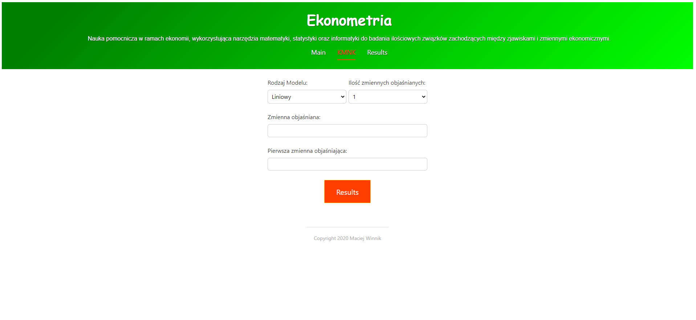
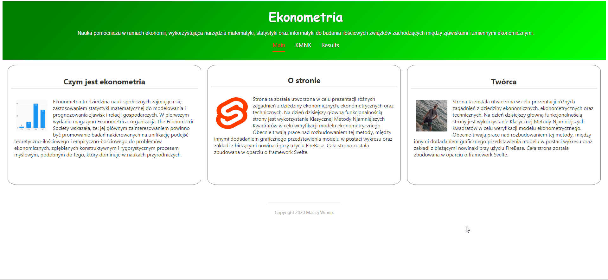

# Simple project built on Svelte Framework

This is my first Svelte project built completely by myself.

This interactive webiste should help student to learn basic of econometric and alo alow them to use KMNK without instaling anything (like Gretl).

